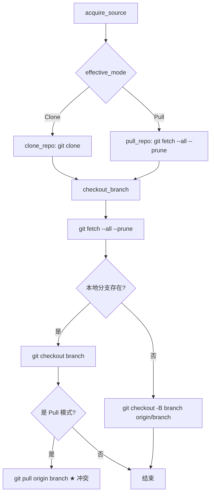
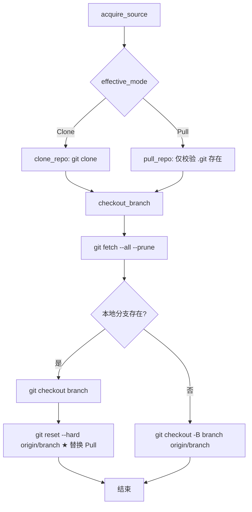

# Git 拉取冲突优化方案

## 1. 问题分析

### 现状

当前代码获取流程（`src/git.rs`）如下：



### 根因

`checkout_branch()` 在 Pull 模式下，检出本地分支后会执行 `git pull origin <branch>`。**当构建机上存在未推送的本地 Commit 时（例如上次构建失败残留、手动调试等），`git pull` 会尝试将远程新 Commit 与本地 Commit 合并，从而产生合并冲突。**

在 CI/CD 场景中，构建机的本地仓库应始终与远程保持完全一致，**不存在保留本地未推送 Commit 的合理需求**。

### 次要问题

- **重复 fetch**：`pull_repo()` 执行了一次 `git fetch --all --prune`，紧接着 `checkout_branch()` 又执行了一次，完全冗余。
- `pull_repo()` 函数名与实际行为不符：它只做了 fetch，没有做 pull。

## 2. 优化方案

### 核心思路

将 Pull 模式下最后的 `git pull origin <branch>` **替换为** `git reset --hard origin/<branch>`，确保本地分支指针和工作目录与远程完全一致，从根本上消除冲突可能性。



### 2.1 修改 `pull_repo()` — 移除冗余 fetch

**当前行为**：校验 `.git` 存在 → fetch

**修改后**：仅校验 `.git` 存在。fetch 由 `checkout_branch()` 统一执行。

```rust
/// 仅验证仓库存在，不执行 fetch（checkout_branch 会统一做）
async fn pull_repo(ctx: &RunContext, config: &ProjectConfig) -> Result<()> {
    if !ctx.repo_dir().join(".git").is_dir() {
        return Err(DeployError::ProjectMismatch {
            message: format!(
                "工作目录 `{}` 不是 Git 仓库，无法执行 pull 模式",
                ctx.repo_dir().display()
            ),
        }
        .into());
    }
    Ok(())
}
```

### 2.2 修改 `checkout_branch()` — `reset --hard` 替代 `git pull`

**关键变更点**：在检出本地分支后，立即执行 `git reset --hard origin/<branch>`，**取代**末尾的 `git pull origin <branch>`。

```rust
async fn checkout_branch(ctx: &RunContext, config: &ProjectConfig) -> Result<()> {
    fetch_remote(ctx, config).await?;

    let branch = &ctx.cli.branch;
    if local_branch_exists(ctx.repo_dir(), branch)? {
        // 本地分支存在 → 检出 → 强制重置到远程跟踪分支
        run_streamed(&CommandSpec {
            stage: "AcquireSource",
            program: "git".to_string(),
            args: vec!["checkout".to_string(), branch.clone()],
            ...
        }).await?;

        // ★ 关键变更：在 Pull 模式下，将本地分支硬重置到 origin/<branch>
        // 确保构建机本地与远程完全一致，消除 pull 冲突
        if matches!(ctx.effective_mode(), AcquireMode::Pull) {
            run_streamed(&CommandSpec {
                stage: "AcquireSource",
                program: "git".to_string(),
                args: vec![
                    "reset".to_string(),
                    "--hard".to_string(),
                    format!("origin/{branch}"),
                ],
                ...
            }).await?;

            // 清理未跟踪文件，避免残留文件影响构建
            run_streamed(&CommandSpec {
                stage: "AcquireSource",
                program: "git".to_string(),
                args: vec!["clean".to_string(), "-fd".to_string()],
                ...
            }).await?;
        }
    } else if remote_branch_exists(ctx.repo_dir(), branch)? {
        // 仅有远程分支 → 创建本地跟踪分支（已在正确位置，无需 reset）
        run_streamed(&CommandSpec {
            ...
            args: vec![
                "checkout".to_string(),
                "-B".to_string(),
                branch.clone(),
                format!("origin/{branch}"),
            ],
            ...
        }).await?;
    } else {
        return Err(DeployError::BranchNotFound { ... }.into());
    }

    // ★ 移除：末尾的 git pull origin <branch> 块
    Ok(())
}
```

### 2.3 诊断信息增强（可选）

在 `git reset --hard` 之前，可以添加一个诊断步骤，检测并记录当前工作目录的脏状态：

```rust
// 检测并记录脏状态（仅用于诊断，不阻断流程）
let has_uncommitted = !is_worktree_clean(ctx.repo_dir())?;
let has_unpushed = has_unpushed_commits(ctx.repo_dir(), branch)?;
if has_uncommitted || has_unpushed {
    ui::print_warning(
        "AcquireSource",
        &format!(
            "检测到构建机本地存在未推送的变更（未提交={}，未推送Commit={}），将自动重置到 origin/{}",
            has_uncommitted, has_unpushed, branch
        ),
    );
}
```

## 3. 变更清单

| 文件 | 变更 | 说明 |
|------|------|------|
| `src/git.rs` | 修改 | `pull_repo()` 移除 fetch；`checkout_branch()` 以 `reset --hard` 替代 `pull`，新增 `git clean` |
| `src/git.rs` | 新增 | 可选：`is_worktree_clean()` / `has_unpushed_commits()` 诊断辅助函数 |
| `src/git.rs` | 新增 | 可选：脏状态警告输出 |
| `src/error.rs` | 无需修改 | 现有错误类型已覆盖 |
| `src/workflow.rs` | 无需修改 | 工作流不变 |

## 4. 风险与注意事项

1. **`git reset --hard` 会丢弃所有本地未提交变更** — 在 CI 场景下这正是期望行为。如果构建机上有调试中但重要的本地变更，应改用 `--mode clone --force-clean` 重新克隆。
2. **`git clean -fd` 会删除未跟踪文件和目录** — 同样适用于 CI 场景。如果仓库内有运行时生成的需要保留的未跟踪文件（如 `.env`），需提前备份或将其加入 `.gitignore`。
3. **向后兼容**：所有 CLI 参数和行为不变，仅优化内部 Git 操作策略。
4. **不影响 Clone 模式**：Clone 模式下 `checkout_branch()` 仍然正常执行，不会触发 `reset --hard`。

## 5. 测试要点

| 测试场景 | 预期 |
|----------|------|
| Pull 模式，本地分支与远程一致 | `reset --hard` 无副作用，构建继续 |
| Pull 模式，本地存在未推送 Commit | `reset --hard` 丢弃本地 Commit，与远程一致 |
| Pull 模式，工作目录有未提交修改 | `reset --hard` + `clean -fd` 清理干净 |
| Pull 模式，仅有远程分支 | 创建 tracking 分支，不执行 reset |
| Clone 模式 | 流程不变，不受影响 |
| `pull_repo()` 移除 fetch 后不引入 fetch 行为 | 无重复 fetch，日志更干净 |

## 6. 分支策略

1. 基于当前工作分支创建优化分支（例如 `fix/git-pull-conflict`）
2. 按顺序提交变更（`src/git.rs` 为主）
3. 运行 `cargo test` 确保现有测试全部通过
4. 合并回主分支
