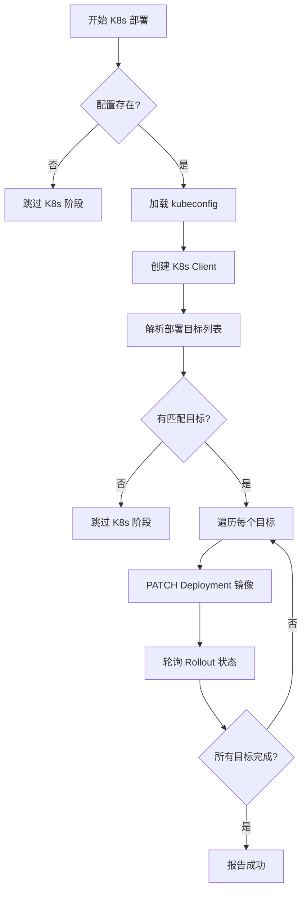

# K8s 自动部署触发方案

## 1. 概述

在 Docker 镜像推送成功后，自动触发 Kubernetes 部署，通过 **Kubernetes PATCH API** 直接更新指定 Deployment 的容器镜像版本。

### 技术选型

| 项目 | 选择 | 说明 |
|------|------|------|
| K8s 客户端 | `kube` crate (0.98+) | 官方 Rust K8s 客户端，原生支持 kubeconfig 解析、证书验证、Token 刷新 |
| API 类型 | `k8s-openapi` crate (0.24+) | 提供类型安全的 Deployment/Pod 等资源结构体 |
| API 操作 | JSON Merge Patch | 通过 `apps/v1` Deployment API 更新容器镜像 |
| 认证方式 | kubeconfig 文件 | 路径在 `.deploy-sc.toml` 中配置 |
| 目标集群 | 阿里云 ACK | |

## 2. 配置变更

### 2.1 `.deploy-sc.toml` 新增 `[k8s]` 节

支持 **数组格式**配置多个 Deployment，每个条目可以通过 `module` 字段关联到多模块项目中的具体模块。

**场景一：单 Deployment（Web 项目或单模块 Java）**

```toml
[git]
base_url = "https://git.company.local"
username = "git-user"
password = "git-password"

[registry]
server = "registry.company.local"
username = "docker-user"
password = "docker-password"

[k8s]
kubeconfig = "/path/to/kube/config"
context = "ack-cluster"              # 可选，默认使用 kubeconfig 的当前 context
namespace = "production"
deployment = "my-app"
container = "app"                    # 可选，默认与 deployment 同名
```

**场景二：多 Deployment（多模块 Java 项目，每个模块独立工作负载）**

```toml
[k8s]
kubeconfig = "/path/to/kube/config"
context = "ack-cluster"

[[k8s.deployments]]
module = "supply-enterprise-admin"       # 关联 --module 参数，仅匹配该模块
namespace = "production"
deployment = "supply-enterprise-admin"
container = "app"

[[k8s.deployments]]
module = "supply-purchaseuser-api"
namespace = "production"
deployment = "supply-purchaseuser-api"
container = "app"

[[k8s.deployments]]
# 无 module 字段 = 默认匹配所有非模块项目/模块不匹配时的兜底
namespace = "production"
deployment = "default-app"
container = "app"
```

**匹配规则：**
1. 如果当前项目是**多模块**且指定了 `--module`，优先匹配 `deployments[].module == module_name` 的条目
2. 如果当前项目是**非模块项目**（Web / 单模块 Java），匹配 `deployments[]` 中**没有 module 字段**的条目
3. 匹配到的所有条目全部执行部署（可能多个）

**与旧格式兼容：** 顶层 `namespace` / `deployment` / `container` 相当于单条无 `module` 的 deployment 条目，二者只需使用一种风格，不可混用。

### 2.2 CLI 新增参数 (`src/cli.rs`)

```rust
/// 跳过 K8s 部署阶段（用于调试或仅构建镜像）
#[arg(long)]
pub skip_k8s: bool,

/// K8s 部署等待就绪的超时秒数
#[arg(long, default_value = "300")]
pub k8s_timeout: u64,
```

## 3. 核心模块设计

### 3.1 `src/k8s.rs` — 新增模块

```
src/k8s.rs
├── K8sConfig              # TOML 反序列化结构（顶层快捷 + 数组格式）
├── K8sDeploymentTarget    # 单个 Deployment 目标（module/namespace/deployment/container）
├── trigger_deployment()   # 主入口：匹配 Deployment 列表并逐个 PATCH
├── resolve_targets()      # 根据 --module 和配置解析要更新的目标列表
├── patch_deployment()     # 构造并发送 JSON Merge Patch 请求
├── watch_rollout()        # 轮询等待单个 Deployment 就绪
└── tests                  # 单元测试
```

#### `trigger_deployment()` 流程



#### `resolve_targets()` 匹配逻辑

```mermaid
flowchart TD
    A[resolve_targets] --> B{是模块项目且指定了--module?}
    B -->|是| C[从 deployments[] 中筛选 module == cli.module 的条目]
    B -->|否| D[筛选 deployments[] 中 module 为空的条目]
    C --> E{有匹配?}
    D --> E
    E -->|无| F{有顶层快捷方式? namespace+deployment 存在?}
    F -->|是| G[使用顶层值作为单个目标]
    F -->|否| H[返回空列表 = 跳过]
    G --> I[返回目标列表]
    E -->|有| I
```

### 3.2 PATCH 请求体示例

```json
{
  "spec": {
    "template": {
      "spec": {
        "containers": [
          {
            "name": "app",
            "image": "registry.cn-guangzhou.aliyuncs.com/sell_prod/my-app:master-abc1234-20260703120000"
          }
        ]
      }
    }
  }
}
```

### 3.3 轮询 Rollout 状态

每 5 秒查询一次 Deployment 状态，判断：

1. `status.observedGeneration >= metadata.generation`
2. `status.updatedReplicas == spec.replicas`
3. `status.availableReplicas == spec.replicas`

## 4. 工作流集成 (`src/workflow.rs`)

现有流程：

```
Preflight → AcquireSource → ValidateProject → LoadCredentials → 
  [Java Package] → DockerLogin → BuildImage → PushImage → RemoveImage → ReportResult
```

变更后流程：

```
Preflight → AcquireSource → ValidateProject → LoadCredentials → 
  [Java Package] → DockerLogin → BuildImage → PushImage → RemoveImage → 
  ★ K8sDeploy → ReportResult
```

新增阶段 `K8sDeploy`：
- 检查 CLI `--skip-k8s` 是否设置 → 跳过
- 检查 config 中 `[k8s]` 节是否存在 → 不存在则跳过（向后兼容）
- 调用 `k8s::trigger_deployment(ctx, project_config, image)`
- 成功后回显部署详情

## 5. 错误处理 (`src/error.rs`)

新增错误类型：

| 错误 | 描述 | 建议 |
|------|------|------|
| `K8sClientError` | kubeconfig 加载 / Client 创建失败 | 检查 kubeconfig 路径和集群可达性 |
| `K8sDeployError` | PATCH API 调用失败 | 检查命名空间和 Deployment 是否存在 |
| `K8sRolloutTimeout` | 超时内 Rollout 未就绪 | 增大 `--k8s-timeout` 或检查 Pod 异常 |

## 6. 依赖变更 (`Cargo.toml`)

```toml
kube = { version = "0.98", default-features = false, features = ["client", "config", "rustls-tls"] }
k8s-openapi = { version = "0.24", features = ["latest"] }
```

注意：使用 `rustls-tls` 而非 `openssl-tls` 以减少编译依赖和跨平台问题。

## 7. 文件变更清单

| 文件 | 操作 | 说明 |
|------|------|------|
| `Cargo.toml` | 修改 | 添加 `kube` + `k8s-openapi` 依赖 |
| `src/config.rs` | 修改 | 新增 `K8sConfig` 结构体 + 校验 |
| `src/cli.rs` | 修改 | 新增 `--skip-k8s` / `--k8s-timeout` 参数 |
| `src/k8s.rs` | **新建** | K8s 部署核心逻辑模块 |
| `src/lib.rs` | 修改 | 注册 `pub mod k8s` |
| `src/workflow.rs` | 修改 | 插入 `K8sDeploy` 阶段 |
| `src/error.rs` | 修改 | 新增 K8s 相关错误类型 |
| `src/context.rs` | 无需修改 | RunContext 不变，配置通过 ProjectConfig 传递 |
| `README.md` | 修改 | 更新配置示例和使用说明 |
| `.github/workflows/*` | 无需修改 | CI/CD 不变 |

## 8. 分支策略

1. 基于当前工作分支创建 `feat/k8s-deploy` 分支（Git 操作由 Code 模式执行）
2. 按顺序提交上述文件变更
3. 完成后推送远程并创建 PR（可选）

## 9. 向后兼容性

- 如果 `.deploy-sc.toml` 中不包含 `[k8s]` 节，则跳过 K8s 部署阶段
- 如果指定了 `--skip-k8s`，即使配置存在也跳过
- 所有现有 CLI 参数和行为保持不变
- 现有 `.deploy-sc.toml` 配置无需修改

## 10. 测试要点

- `K8sConfig` 的 TOML 解析与校验单元测试
- `--skip-k8s` 参数正确跳过 K8s 阶段
- 缺少 `[k8s]` 配置时正常工作（向后兼容）
- PATCH 请求体构造的正确性
